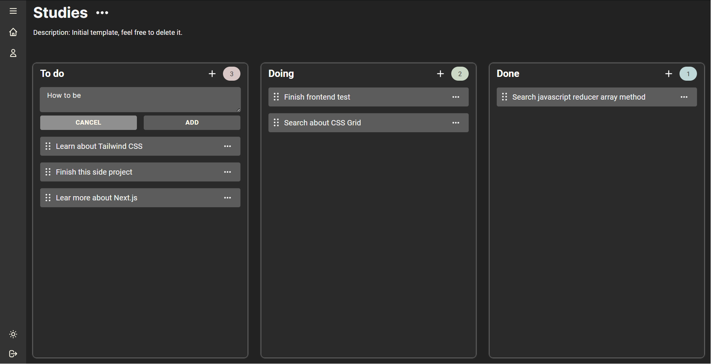
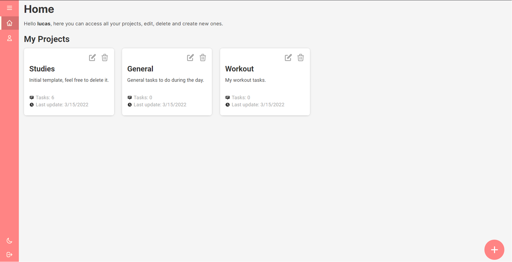

# Task Manager - Lucid Task

This is the frontend of the app, the backend can be found on [this repository](https://github.com/lucas-santosP/task-manager-backend).

# Built with

- React
- Typescript
- Styled Components
- Mobx
- Wouter
- Browser native Drag and drop API

# Demonstration

### Switch dark and light theme


<br/>

### Kanban with drag and drop tasks


<br/>


<br/>

### And more...


<br/>

`- Deploy link soon...`

# Setup

Create a file in the root folder named .env and type:

```
REACT_APP_API_URL=<your-api-url-here>
```

### `yarn`

To install all dependencies required to run the project.

### `yarn start`

Runs the app in the development mode.\
Open [http://localhost:3000](http://localhost:3000) to view it in the browser.

### `yarn build`

Builds the app for production to the `build` folder.\
It correctly bundles React in production mode and optimizes the build for the best performance.

The build is minified and the filenames include the hashes.\
Your app is ready to be deployed!
